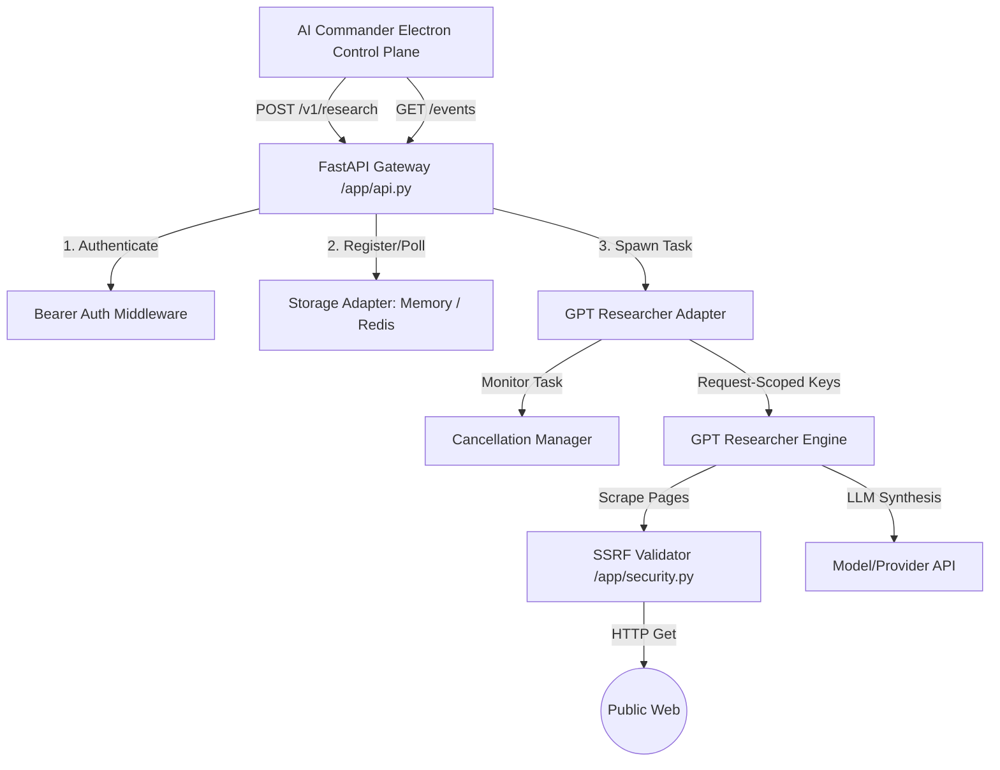

# Web Intelligence Agent (Python Sidecar)

The Web Intelligence Agent is a lightweight, production-ready Python FastAPI sidecar that wraps the open-source **GPT Researcher** engine. It exposes structured, multi-step web research capabilities to the AI Commander desktop control plane.

This service is designed to run in two modes:
1. **Local Mode**: Spawned and managed locally by the Electron control plane on a dynamic loopback port with ephemeral token authentication.
2. **Remote Mode**: Deployed as an auto-scaling, Docker-based container cluster on Render.com, backed by a Valkey/Redis instance for shared operation state and progress streams.

---

## 1. Features
- **Iterative Research Orchestration**: Plans and executes multi-query web searches, scrapes pages, and synthesizes answers using GPT Researcher.
- **SSRF Hardened Egress**: Validates explicit URL queries, guards outbound HTTP clients before connection, checks DNS resolution for private IPv4/IPv6 ranges, carrier-grade NAT, and cloud metadata endpoints, and redacts unsafe source URLs from final results.
- **Isolate Request Keys**: Applies OpenAI and Tavily API credentials in request scopes only, preventing race conditions or process-wide leaks.
- **Process Memory Guardrails**: Monitored via a background task. If memory footprint exceeds 80% of the configured limit, the sidecar stops the active research loop and attempts a bounded partial synthesis.
- **Durable Event Streaming**: Emits live progress logs (`planning`, `searching`, `reading`, `synthesizing`, etc.) via Server-Sent Events (SSE) backed by Redis Streams in cluster mode.
- **Task Cancellations**: Provides REST-based endpoints to abort running async loops.
- **Prometheus Telemetry**: Exposes research operation counters, duration and fetched-source histograms, and estimated output-token spend counters.

### Current Adapter Behavior
- Responses include source URLs, source-level citations, passage-level evidence, and claim records extracted from GPT Researcher source/context records when safe source text is available.
- Claim records are generated from synthesized report claims and verified by a separate passage-matching pass over available evidence, marking claims as `supported`, `partially-supported`, `unsupported`, or `conflicting`.
- Source metadata is populated from GPT Researcher source/search records when available, including title, publisher, author, published date, and quality score.
- `freshness` constraints are applied to the research prompt for recency-aware source selection.
- `inputs.documents` and `inputs.repositories` are processed as bounded local first-party evidence. Their contents are not sent to external research providers unless `inputs.allowExternalUse=true`.
- `sourcePolicy.allowedDomains` is supported and passed to GPT Researcher as a domain constraint. Other `sourcePolicy` fields are rejected.
- `model_provider` and `model_name` are supported as request-scoped GPT Researcher model preferences.
- Model-call, output-token, and cost budgets are enforced with deterministic estimates. Token and cost overruns return a `partial` result with a limitation note.
- If GPT Researcher exposes a safe source URL but no source text, the adapter falls back to inferred report-derived claims for that source and marks that limitation in the response.

---

## 2. Service Architecture



---

## 3. REST API Specification

Detailed OpenAPI documentation is available under `api/openapi.yaml`.

### 3.1 Health & Verification
- **`GET /health/live`**: Fast liveness probe checking process response (used by Render).
- **`GET /health/ready`**: Probes storage backends (Redis) and engine dependencies.
- **`GET /capabilities`**: Lists active features supported by the sidecar.
- **`GET /metrics`**: Prometheus metrics for operation outcomes, duration, fetched sources, and estimated output tokens.
- **`GET /version`**: Returns service and gpt-researcher version strings.

### 3.2 Operations Workflow
- **`POST /v1/research`**: Enqueues a new query. Returns `202 Accepted` with the `operationId`. Supports idempotency key checks via `Idempotency-Key` header.
- **`GET /v1/research/{operationId}/events`**: Server-Sent Events (SSE) stream of task progression logs.
- **`GET /v1/research/{operationId}/result`**: Fetches the completed synthesis report, source URLs, source-level citations, metrics, and adapter limitations.
- **`POST /v1/research/{operationId}/cancel`**: Interrupts the active research task.

---

## 4. Configuration & Environment Variables

| Variable | Default | Description |
| :--- | :--- | :--- |
| `DEPLOYMENT_MODE` | `local` | Service deployment mode: `local` (Electron sidecar) or `remote` (Render). |
| `WEB_INTELLIGENCE_AUTH_TOKEN` | `""` | Bearer token verified on incoming API requests (auto-generated in local mode). |
| `ALLOW_UNAUTHENTICATED_DOCS` | `false` | When `true` in local mode, exposes `/docs`, `/redoc`, and `/openapi.json` for plain-browser testing. Ignored in remote mode. |
| `STORAGE_BACKEND` | `local` | Persistence mode: `local` (in-memory dicts) or `redis` (Render Valkey cache). |
| `REDIS_URL` | `""` | Connection URL for Redis instances (e.g. `redis://red-xxx:6379`). |
| `MAX_CONCURRENT_OPS` | `3` | Maximum number of concurrent research jobs allowed in the process. |
| `MAX_MEMORY_MB` | `512` | Memory threshold limits (MB) prior to triggering early partial synthesis. |
| `DAILY_SPEND_LIMIT_USD` | `50.0` | Warning threshold for estimated output-token spend. |
| `CORS_ORIGINS` | `""` | Comma-separated list of approved CORS domain origins. |

---

## 5. Local Setup & Installation

### 5.1 Prerequisites
- Python 3.11+
- virtualenv

### 5.2 Commands
```bash
# 1. Navigate to the agent directory
cd WEB_INTELLIGENCE_AGENT_PATH

# 2. Create and activate a virtual environment
python3 -m venv .venv
source .venv/bin/activate

# 3. Install pinned dependencies
pip install -r requirements.lock

# 4. Spin up the FastAPI server locally
uvicorn app.main:app --host 127.0.0.1 --port 8080

# 5. Run the sidecar test suite
pytest
```

### 5.3 Browser Testing

The sidecar protects API routes with bearer-token authentication. If you open a protected route directly in a plain browser tab, the expected response is:

```json
{"detail":"Unauthorized: Missing authentication bearer token"}
```

For local browser testing, start the service with unauthenticated docs enabled:

```bash
WEB_INTELLIGENCE_AUTH_TOKEN=dev-token ALLOW_UNAUTHENTICATED_DOCS=true uvicorn app.main:app --host 127.0.0.1 --port 8081
```

Then open:

- `http://127.0.0.1:8081/docs`
- `http://127.0.0.1:8081/redoc`
- `http://127.0.0.1:8081/openapi.json`

Unauthenticated docs are only exposed when `DEPLOYMENT_MODE=local` and `ALLOW_UNAUTHENTICATED_DOCS=true`. Research, result, event, and cancel routes still require:

```http
Authorization: Bearer dev-token
```

Public local smoke-test URLs:

- `http://127.0.0.1:8081/health/live`
- `http://127.0.0.1:8081/capabilities`
- `http://127.0.0.1:8081/metrics`

---

## 6. Remote Deployment (Render.com)

Render deployments use the Blueprint template (`render.yaml`) and build directly from the `Dockerfile`.

1. Go to your **Render Dashboard** > **New** > **Blueprint**.
2. Select your `Web-Intelligence-Agent` Git repository.
3. Render will provision:
   - The FastAPI web service linked to `Dockerfile` with liveness checks at `/health/live`.
   - The Valkey database instance used for cluster queues.
4. Set your provider API keys (`OPENAI_API_KEY`, `TAVILY_API_KEY`) as **Environment Variables** in the Render service dashboard. These are injected directly into the container's `os.environ` at startup.

> **Note on secrets flow:** In local mode the sidecar inherits API keys from the Electron control plane's `process.env`, which loads them from AI Commander's centralized SOPS-encrypted secrets store (`secrets.enc.env`). In remote mode, Render's native environment variable injection replaces that mechanism. Do not introduce a separate secrets file loader — credentials always flow through environment variables regardless of deployment mode.
